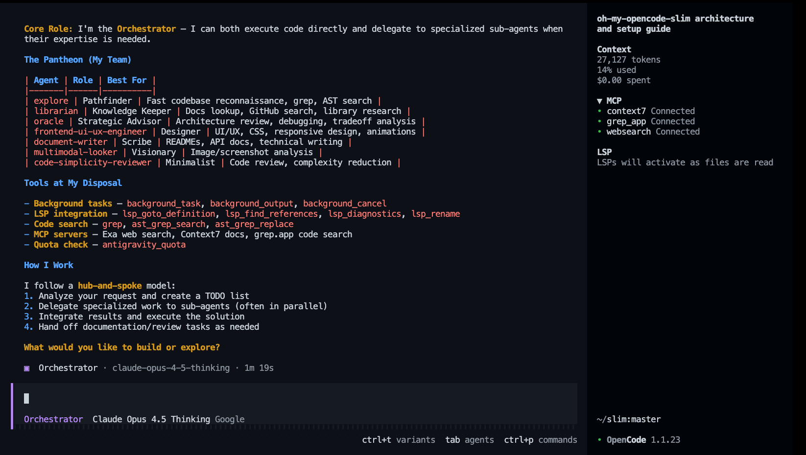
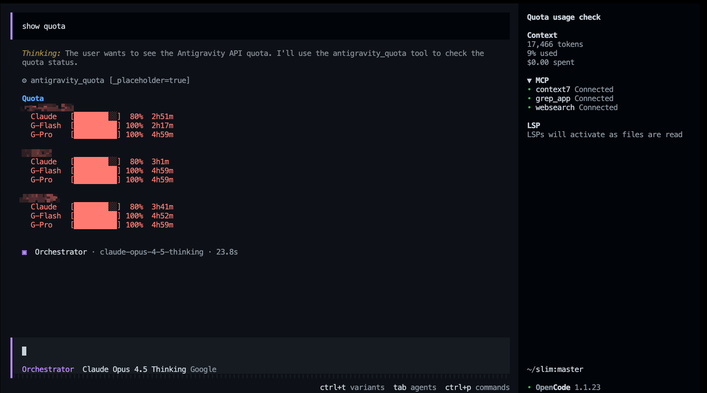

<div align="center">

# oh-my-opencode-slim

**A lightweight, powerful agent orchestration plugin for OpenCode**

<a href="https://x.com/alvinunreal" target="_blank" rel="noopener noreferrer">
  
</a>

<br>


*Transform your AI assistant into a manager capable of delegating complex tasks to specialized sub-agents, running searches in the background, and managing multi-step workflows with ease.*

</div>

> Slimmed-down fork of [oh-my-opencode](https://github.com/code-yeongyu/oh-my-opencode) - focused on core agent orchestration with low token consumption.

> **[Antigravity](https://antigravity.google) subscription recommended.** The pantheon is tuned for Antigravity's model routing. Other providers work, but you'll get the best experience with Antigravity.

---

## ⚡ Quick Navigation

- [🚀 **Installation**](#installation)
  - [For Humans](#for-humans)
  - [For LLM Agents](#for-llm-agents)
- [🏗️ **Architecture & Flow**](#architecture--flow)
- [🏛️ **Meet the Pantheon**](#meet-the-pantheon)
  - [Orchestrator](#orchestrator)
  - [Explorer](#explorer)
  - [Oracle](#oracle)
  - [Librarian](#librarian)
  - [Designer](#designer)
  - [Fixer](#fixer)
- [🧩 **Skills**](#-skills)
  - [Available Skills](#available-skills)
  - [Default Skill Assignments](#default-skill-assignments)
  - [YAGNI Enforcement](#yagni-enforcement)
  - [Playwright Integration](#playwright-integration)
  - [Customizing Agent Skills](#customizing-agent-skills)
- [🛠️ **Tools & Capabilities**](#tools--capabilities)
  - [Tmux Integration](#tmux-integration)
  - [Quota Tool](#quota-tool)
  - [Background Tasks](#background-tasks)
  - [LSP Tools](#lsp-tools)
  - [Code Search Tools](#code-search-tools)
- [🔌 **MCP Servers**](#mcp-servers)
- [⚙️ **Configuration**](#configuration)
  - [Files You Edit](#files-you-edit)
  - [OpenCode Config](#opencode-config-opencodejson)
  - [Plugin Config](#plugin-config-oh-my-opencode-slimjson)
- [🗑️ **Uninstallation**](#uninstallation)

---

## Installation

### For Humans

Run the interactive installer:

```bash
bunx oh-my-opencode-slim install
```

Or use non-interactive mode:

```bash
bunx oh-my-opencode-slim install --no-tui --antigravity=yes --openai=yes --tmux=no
```

After installation, authenticate with your providers:

```bash
opencode auth login
# Select your provider → Complete OAuth flow
# Repeat for each provider you enabled
```

Once authenticated, run opencode and `ping all agents` to verify all agents respond.


> **💡 Tip: Models are fully customizable.** The installer sets sensible defaults, but you can assign *any* model to *any* agent. Edit `~/.config/opencode/oh-my-opencode-slim.json` to override models, adjust reasoning effort, or disable agents entirely. See [Configuration](#configuration) for details.

**Alternative: Ask any coding agent**

Paste this into Claude Code, AmpCode, Cursor, or any coding agent:

```
Install and configure by following the instructions here:
https://raw.githubusercontent.com/alvinunreal/oh-my-opencode-slim/refs/heads/master/README.md
```

### For LLM Agents

<details>
<summary>Instructions for LLM Agents (click to expand)</summary>

If you're an LLM Agent helping set up oh-my-opencode-slim, follow these steps.

---

#### Step 1: Check OpenCode Installation

```bash
opencode --version
```

If not installed, direct the user to https://opencode.ai/docs first.

---

#### Step 2: Ask About Provider Access

Ask these questions **one at a time**, waiting for responses:

1. "Do you have an **Antigravity** subscription?" *(Provides Claude + Gemini via `google/` prefix)*
2. "Do you have access to **OpenAI** API?" *(Enables `openai/` models)*

Help the user understand the tradeoffs:
- Antigravity is the recommended path for Claude + Gemini routing.
- OpenAI is optional; it enables `openai/` models.
- If the user has **no providers**, the plugin still works using **OpenCode Zen** free models. They can switch to paid providers later by editing `~/.config/opencode/oh-my-opencode-slim.json`.

---

#### Step 3: Run the Installer

Based on answers, run:

```bash
bunx oh-my-opencode-slim install --no-tui --antigravity=<yes|no> --openai=<yes|no>
```

**Examples:**
```bash
# Antigravity + OpenAI
bunx oh-my-opencode-slim install --no-tui --antigravity=yes --openai=yes --tmux=no

# OpenAI only
bunx oh-my-opencode-slim install --no-tui --antigravity=no --openai=yes --tmux=no

# No providers (Zen free models only)
bunx oh-my-opencode-slim install --no-tui --antigravity=no --openai=no --tmux=no
```

The installer automatically:
- Adds the plugin to `~/.config/opencode/opencode.json`
- Adds `opencode-antigravity-auth` plugin (if Antigravity enabled)
- Configures Google provider with model definitions
- Generates agent model mappings in `~/.config/opencode/oh-my-opencode-slim.json`

**Crucial Advice for the User:**
- They can easily assign **different models to different agents** by editing `~/.config/opencode/oh-my-opencode-slim.json`.
- If they add a new provider later, they just need to update this file.
- Read generated  `~/.config/opencode/oh-my-opencode-slim.json` file and report the model configuration.

---

#### Step 4: Authentication

After installation, guide the user:

**For Antigravity/OpenAI:**
```bash
opencode auth login
# Select: Google → OAuth with Google (Antigravity)
# Repeat for all other providers
```

---

#### Troubleshooting

If the installer fails, check the expected config format:
```bash
bunx oh-my-opencode-slim install --help
```

Then manually create the config files at:
- `~/.config/opencode/oh-my-opencode-slim.json`

</details>

---

## 🏗️ Architecture & Flow

The plugin follows a "Hub and Spoke" model:

1. **The Orchestrator (Hub)**: The main entry point for user requests. It analyzes the task and decides which specialized agents to call.
2. **Specialized Agents (Spokes)**: Domain-specific experts (e.g., UI/UX, Documentation, Architecture) that handle narrow tasks with high precision.
3. **Background Manager**: A robust engine that allows the Orchestrator to "fire and forget" tasks (like deep codebase searches or documentation research) while continuing to work on other parts of the problem.

### 🏛️ The Flow of a Request



1. **User Prompt**: "Refactor the auth logic and update the docs."
2. **Orchestrator**: Creates a TODO list.
3. **Delegation**:
   - Launches an `@explorer` background task to find all auth-related files.
   - Launches a `@librarian` task to check the latest documentation for the auth library used.
4. **Integration**: Once background results are ready, the Orchestrator delegates to `@fixer` to perform the refactor efficiently.

---

### Primary vs Subagents

Primary agents appear in the OpenCode UI selector, while subagents are hidden from the UI and intended for delegation through `background_task`.

**Primary agents (UI):**
- OpenCode built-ins: `Build`, `Plan` (disabled by the installer by default)
- Plugin primary: `orchestrator`

**Subagents (background_task):** `explorer`, `librarian`, `oracle`, `designer`, `fixer`

The `background_task` tool lists only subagents. If the UI list looks stale after changes, restart OpenCode.

---

## Meet the Pantheon

<br clear="both">

### Orchestrator

<a href="src/agents/orchestrator.ts"></a>

> **The Orchestrator** was born when the first codebase collapsed under its own complexity. Neither god nor mortal would claim responsibility - so The Orchestrator emerged from the void, forging order from chaos. They don't merely command armies; they fight alongside them. Every line of code passes through their hands before they decide which lesser deity deserves a piece of the puzzle.

**Role:** `Supreme executor, delegator, and overseer`  
**Model:** `google/claude-opus-4-5-thinking`  
**Prompt:** [src/agents/orchestrator.ts](src/agents/orchestrator.ts)

Write and execute code, orchestrate multi-agent workflows, parse the unspoken from the spoken, summon specialists mid-battle. *Shape reality directly - and assign realms to others when the universe grows too vast.*

<br clear="both">

---

### Explorer

<a href="src/agents/explore.ts"></a>

> **The Explorer** moves through codebases like wind through trees - swift, silent, everywhere at once. When The Orchestrator whispers "find me the auth module," The Explorer has already returned with forty file paths and a map. They were born from the first `grep` command, evolved beyond it, and now see patterns mortals miss.

**Role:** `Codebase reconnaissance`  
**Model:** `google/gemini-3-flash`  
**Prompt:** [src/agents/explorer.ts](src/agents/explorer.ts)

Regex search, AST pattern matching, file discovery, parallel exploration. *Read-only: they chart the territory; others conquer it.*

<br clear="both">

---

### Oracle

<a href="src/agents/oracle.ts"></a>

> **The Oracle** does not code - they *know*. When bugs defy logic and architectures crumble, The Oracle gazes into the abyss of your codebase and speaks truth. They've seen a thousand systems rise and fall. They'll tell you which path leads to ruin, and which to production.

**Role:** `Strategic advisor and debugger of last resort`  
**Model:** `openai/gpt-5.2-codex`  
**Prompt:** [src/agents/oracle.ts](src/agents/oracle.ts)

Root cause analysis, architecture review, debugging guidance, tradeoff analysis. *Read-only: Oracles advise; they don't intervene.*

<br clear="both">

---

### Librarian

<a href="src/agents/librarian.ts"></a>

> **The Librarian** guards a library with no walls - every GitHub repo, every npm package, every StackOverflow answer ever written. Ask them "how does React handle concurrent rendering?" and they'll return with official docs, real-world examples, and a warning about the footgun you're about to step on.

**Role:** `External knowledge retrieval`  
**Model:** `google/gemini-3-flash`  
**Prompt:** [src/agents/librarian.ts](src/agents/librarian.ts)

Documentation lookup, GitHub code search, library research, best practice retrieval. *Read-only: they fetch wisdom; implementation is for others.*

<br clear="both">

---

### Designer

<a href="src/agents/designer.ts"></a>

> **The Designer** believes code should be beautiful - and so should everything it renders. Born from the frustration of a thousand ugly MVPs, they wield CSS like a brush and components like clay. Hand them a feature request; receive a masterpiece. They don't do "good enough."

**Role:** `UI/UX implementation and visual excellence`  
**Model:** `google/gemini-3-flash`  
**Prompt:** [src/agents/designer.ts](src/agents/designer.ts)

Modern responsive design, CSS/Tailwind mastery, micro-animations, component architecture. *Visual excellence over code perfection - beauty is the priority.*

<br clear="both">

---

### Fixer

<a href="src/agents/fixer.ts"></a>

> **The Fixer** is the hands that build what others envision. While The Orchestrator plans and The Oracle advises, The Fixer executes. They receive complete context from research agents and clear task specifications, then implement with surgical precision. Fast, efficient, and focused - they don't think about what to build, they just build it.

**Role:** `Fast implementation specialist`  
**Model:** `google/gemini-3-flash`  
**Prompt:** [src/agents/fixer.ts](src/agents/fixer.ts)

Code implementation, refactoring, testing, verification. *Execute the plan - no research, no delegation, no planning.*

<br clear="both">

---

## Tools & Capabilities

### Tmux Integration

> ⚠️ **Known Issue:** When the server port is enabled, only one OpenCode instance can be opened at a time. We're tracking this in [issue #15](https://github.com/alvinunreal/oh-my-opencode-slim/issues/15), and there's an upstream PR to OpenCode: [opencode#9099](https://github.com/anomalyco/opencode/issues/9099).


**Watch your agents work in real-time.** When the Orchestrator launches sub-agents or initiates background tasks, new tmux panes automatically spawn showing each agent's live progress. No more waiting in the dark.

#### Why This Matters

| Without Tmux Integration | With Tmux Integration |
|--------------------------|----------------------|
| Fire off a background task, wait anxiously | See the agent thinking, searching, coding |
| "Is it stuck or just slow?" | Watch tool calls happen in real-time |
| Results appear out of nowhere | Follow the journey from question to answer |
| Debug by guessing | Debug by observation |

#### What You Get

- **Live Visibility**: Each sub-agent gets its own pane showing real-time output
- **Auto-Layout**: Tmux automatically arranges panes using your preferred layout
- **Auto-Cleanup**: Panes close when agents finish, layout rebalances
- **Zero Overhead**: Works with OpenCode's built-in `task` tool AND our `background_task` tool

#### Quick Setup

1. **Enable the OpenCode HTTP server** in `opencode.json` (see [OpenCode Config](#opencode-config-opencodejson)).
2. **Enable tmux integration** in `oh-my-opencode-slim.json` (see [Plugin Config](#plugin-config-oh-my-opencode-slimjson)).
3. **Run OpenCode inside tmux**:
   ```bash
   tmux
   opencode
   ```

#### Layout Options

| Layout | Description |
|--------|-------------|
| `main-vertical` | Your session on the left (60%), agents stacked on the right |
| `main-horizontal` | Your session on top (60%), agents stacked below |
| `tiled` | All panes in equal-sized grid |
| `even-horizontal` | All panes side by side |
| `even-vertical` | All panes stacked vertically |

*See the [Option Reference](#option-reference) for detailed configuration.*

---

### Quota Tool

For Antigravity users. You can trigger this at any time by asking the agent to **"check my quota"** or **"show status."**



| Tool | Description |
|------|-------------|
| `antigravity_quota` | Check API quota for all Antigravity accounts (compact view with progress bars) |

---

### Background Tasks

The plugin provides tools to manage asynchronous work:

| Tool | Description |
|------|-------------|
| `background_task` | Launch an agent in a new session (`sync=true` blocks, `sync=false` runs in background) |
| `background_output` | Fetch the result of a background task by ID |
| `background_cancel` | Abort running tasks |

---

### LSP Tools

Language Server Protocol integration for code intelligence:

| Tool | Description |
|------|-------------|
| `lsp_goto_definition` | Jump to symbol definition |
| `lsp_find_references` | Find all usages of a symbol across the workspace |
| `lsp_diagnostics` | Get errors/warnings from the language server |
| `lsp_rename` | Rename a symbol across all files |

---

### Code Search Tools

Fast code search and refactoring:

| Tool | Description |
|------|-------------|
| `grep` | Fast content search using ripgrep |
| `ast_grep_search` | AST-aware code pattern matching (25 languages) |
| `ast_grep_replace` | AST-aware code refactoring with dry-run support |

---

## 🧩 Skills

Skills are specialized capabilities that agents can use. Each agent has a default set of skills, which you can override in the agent config.

### Available Skills

| Skill | Description |
|-------|-------------|
| `yagni-enforcement` | Code complexity analysis and YAGNI enforcement |
| `playwright` | Browser automation via Playwright MCP |

### Default Skill Assignments

| Agent | Default Skills |
|-------|----------------|
| `orchestrator` | `*` (all skills) |
| `designer` | `playwright` |
| `oracle` | none |
| `librarian` | none |
| `explorer` | none |
| `fixer` | none |

### YAGNI Enforcement

**The Minimalist's sacred truth: every line of code is a liability.**

Use after major refactors or before finalizing PRs. Identifies unnecessary complexity, challenges premature abstractions, estimates LOC reduction, and enforces minimalism.

### Playwright Integration

**Browser automation for visual verification and testing.**

- **Browser Automation**: Full Playwright capabilities (browsing, clicking, typing, scraping).
- **Screenshots**: Capture visual state of any web page.
- **Sandboxed Output**: Screenshots saved to session subdirectory (check tool output for path).

### Customizing Agent Skills

Override skills per-agent in your [Plugin Config](#plugin-config-oh-my-opencode-slimjson):

```json
{
  "agents": {
    "orchestrator": {
      "skills": ["*"]
    },
    "designer": {
      "skills": ["playwright"]
    }
  }
}
```

---

## MCP Servers

Built-in Model Context Protocol servers (enabled by default):

| MCP | Purpose | URL |
|-----|---------|-----|
| `websearch` | Real-time web search via Exa AI | `https://mcp.exa.ai/mcp` |
| `context7` | Official library documentation | `https://mcp.context7.com/mcp` |
| `grep_app` | GitHub code search via grep.app | `https://mcp.grep.app` |

### Disabling MCPs

You can disable specific MCP servers by adding them to the `disabled_mcps` array in your [Plugin Config](#plugin-config-oh-my-opencode-slimjson).

---

## Configuration

### Files You Edit

| File | Purpose |
|------|---------|
| `~/.config/opencode/opencode.json` | OpenCode core settings (server port for tmux) |
| `~/.config/opencode/oh-my-opencode-slim.json` | Plugin settings (agents, tmux, MCPs) |
| `.opencode/oh-my-opencode-slim.json` | Project-local plugin overrides (optional) |

> **Platform paths:** On Windows, user config may also be at `%APPDATA%\opencode\`.

---

### Plugin Config (`oh-my-opencode-slim.json`)

The installer generates this file based on your providers. You can manually customize it to mix and match models.

<details open>
<summary><b>Example: Antigravity + OpenAI (Recommended)</b></summary>

```json
{
  "agents": {
    "orchestrator": { "model": "google/claude-opus-4-5-thinking", "skills": ["*"] },
    "oracle": { "model": "openai/gpt-5.2-codex", "skills": [] },
    "librarian": { "model": "google/gemini-3-flash", "skills": [] },
    "explorer": { "model": "google/gemini-3-flash", "skills": [] },
    "designer": { "model": "google/gemini-3-flash", "skills": ["playwright"] },
    "fixer": { "model": "google/gemini-3-flash", "skills": [] }
  },
  "tmux": {
    "enabled": true,
    "layout": "main-vertical",
    "main_pane_size": 60
  }
}
```
</details>

<details>
<summary><b>Example: Antigravity Only</b></summary>

```json
{
  "agents": {
    "orchestrator": { "model": "google/claude-opus-4-5-thinking", "skills": ["*"] },
    "oracle": { "model": "google/claude-opus-4-5-thinking", "skills": [] },
    "librarian": { "model": "google/gemini-3-flash", "skills": [] },
    "explorer": { "model": "google/gemini-3-flash", "skills": [] },
    "designer": { "model": "google/gemini-3-flash", "skills": ["playwright"] },
    "fixer": { "model": "google/gemini-3-flash", "skills": [] }
  }
}
```
</details>

<details>
<summary><b>Example: OpenAI Only</b></summary>

```json
{
  "agents": {
    "orchestrator": { "model": "openai/gpt-5.2-codex", "skills": ["*"] },
    "oracle": { "model": "openai/gpt-5.2-codex", "skills": [] },
    "librarian": { "model": "openai/gpt-5.1-codex-mini", "skills": [] },
    "explorer": { "model": "openai/gpt-5.1-codex-mini", "skills": [] },
    "designer": { "model": "openai/gpt-5.1-codex-mini", "skills": ["playwright"] },
    "fixer": { "model": "openai/gpt-5.1-codex-mini", "skills": [] }
  }
}
```
</details>

#### Option Reference

| Option | Type | Default | Description |
|--------|------|---------|-------------|
| `tmux.enabled` | boolean | `false` | Enable tmux pane spawning for sub-agents |
| `tmux.layout` | string | `"main-vertical"` | Layout preset: `main-vertical`, `main-horizontal`, `tiled`, `even-horizontal`, `even-vertical` |
| `tmux.main_pane_size` | number | `60` | Main pane size as percentage (20-80) |
| `disabled_agents` | string[] | `[]` | Agent IDs to disable (e.g., `"explorer"`) |
| `disabled_mcps` | string[] | `[]` | MCP server IDs to disable (e.g., `"websearch"`) |
| `agents.<name>.model` | string | — | Override the LLM for a specific agent |
| `agents.<name>.variant` | string | — | Reasoning effort: `"low"`, `"medium"`, `"high"` |
| `agents.<name>.skills` | string[] | — | Skills this agent can use (`"*"` = all) |
| `agents.<name>.temperature` | number | — | Temperature for this agent (0.0 to 2.0) |
| `agents.<name>.prompt` | string | — | Base prompt override for this agent |
| `agents.<name>.prompt_append` | string | — | Text to append to the base prompt |
| `agents.<name>.disable` | boolean | — | Disable this specific agent |

---

## Uninstallation

1. **Remove the plugin from your OpenCode config**:

   Edit `~/.config/opencode/opencode.json` and remove `"oh-my-opencode-slim"` from the `plugin` array.

2. **Remove configuration files (optional)**:
   ```bash
   rm -f ~/.config/opencode/oh-my-opencode-slim.json
   rm -f .opencode/oh-my-opencode-slim.json
   ```

---

## Credits

This is a slimmed-down fork of [oh-my-opencode](https://github.com/code-yeongyu/oh-my-opencode) by [@code-yeongyu](https://github.com/code-yeongyu).

---

## License

MIT
